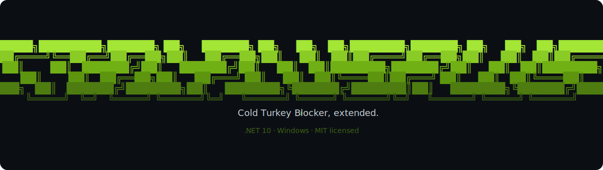

<p align="center">  </p> <p align="center"> <b>A community-built add-on for <a href="https://getcoldturkey.com/">Cold Turkey Blocker</a> that adds the features the official app doesn't have.</b> </p> <p align="center">        </p>

> [!IMPORTANT]
> CTBL++ **requires the paid version of Cold Turkey Blocker.** It is not a crack, bypass, or a way to get paid features for free; it runs *alongside* Cold Turkey and extends it. CTBL++ is an independent community project and is **not affiliated with or endorsed by** the Cold Turkey developer.

Cold Turkey is one of the best blocking tools out there, but there are features the developer has said they don't plan to build. CTBL++ fills that gap. It runs alongside Cold Turkey and extends it with new lock types, enforcement mechanics, and features the community wants.

---

## Features

<table>
<tr>
  <td width="190"><b>Queued Delay lock</b><br><sub><code>shipped</code></sub></td>
  <td>Cold Turkey normally requires a block to be <i>off</i> before you can change it — its most vulnerable moment and the easiest point to relapse. The Queued Delay lock type removes that moment entirely: instead of unlocking to make a change, you <b>queue</b> the change and it executes after a delay you chose <i>in advance</i>. There's nothing to re-lock and no instant access for an impulse to act on.</td>
</tr>
<tr>
  <td><b>Tamper resistance</b><br><sub><code>shipped</code></sub></td>
  <td>A background Engine service backed by two cross-monitoring watchdogs (Wd1 / Wd2). They watch the Engine and each other, restart on death, and mark themselves critical, making the enforcement layer hard to simply kill.</td>
</tr>
<tr>
  <td><b>Local AI categorization</b><br><sub><code>planned</code></sub></td>
  <td>A local AI feature that automatically categorizes sites, searches, and apps against your stated goals and adds them to the right blocklist without you having to manage it manually.</td>
</tr>
</table>

---

## Who this is for

People who feel like Cold Turkey's current options aren't quite enough. If you've ever wished you could **add friction to your own unblocking**, set **stricter rules** than the app currently allows, or just want **more control** over how your blocks behave — this is that project.

---

## Getting started

> **Status:** CTBL++ is in active alpha. There are no pre-built releases yet, so for now you build from source. Prebuilt installer releases are on the roadmap.

### Prerequisites

- **Windows** (the solution targets `net10.0-windows`)
- **Cold Turkey Blocker (paid version)**, installed at its default location (`C:\Program Files\Cold Turkey`)
- [**.NET 10 SDK**](https://dotnet.microsoft.com/download)
- [**Node.js**](https://nodejs.org/) (used to build the patched web UI via webpack)
- An **Administrator** terminal (CTBL++ installs Windows services and patches files under `Program Files`)

### Build

The repo ships an interactive build menu; there is no `.sln`, so each project is built individually.

```bat
:: from the repo root, in an Administrator terminal
ctbl.bat
```

```
 ================================================
  CTBL++ v0.2.1.2
 ================================================
  [1] Build all projects      <- builds Engine + Wd1 + Wd2, repackages Payload.zip, builds the Installer
  [2] Launch Installer
  [3] Launch Engine (console mode)
  [0] Exit
```

Pick **[1] Build all projects**, then **[2] Launch Installer** to run the setup wizard.

### Patch the Cold Turkey UI

The CTBL++ interface is delivered by patching Cold Turkey's own web front-end (there is no separate window). To build and deploy the UI patch:

```powershell
# self-elevates to Administrator; backs up the original web folder first
.\Deploy.ps1
```

This runs the webpack build and replaces `C:\Program Files\Cold Turkey\web` with the patched UI, keeping a timestamped backup (`web.bak_<date>`) so you can roll back. Restart Cold Turkey for changes to take effect.

---

## Architecture

CTBL++ is a **multi-project .NET 10 (Windows)** solution. The UI is delivered by patching Cold Turkey's own web interface, and all real work happens in a background service that the UI talks to over a local REST API.

| Project | Type | Role |
|---|---|---|
| **CtblPlusPlus.Core** | Class library (headless) | Shared core: queue, persistence, security, lockdown, system & app control. Referenced by every other project. |
| **CtblPlusPlus.Engine** | Windows Service | The only process that does real work. Hosts the repositories, queue dispatcher, enforcer/lockdown battery, and the local REST API on `http://127.0.0.1:58123`. |
| **CtblPlusPlus.Wd1 / Wd2** | Windows Services | Watchdogs. Monitor the Engine and each other, restart on death, mark self critical. |
| **CtblPlusPlus.Installer** | WPF + WebView2 | The setup wizard. Embeds the published payload and ships the Cold Turkey installer. |

```
CtblPlusPlus.Core            (lowest layer, references no other project)
   ▲           ▲        ▲           ▲
   │           │        │           │
 Engine       Wd1      Wd2      Installer     (each references Core only)
```

The patched UI talks to the Engine over HTTP against `http://127.0.0.1:58123/api/...`. See [`CtblPlusPlus.Core/architecture.md`](CtblPlusPlus.Core/architecture.md) for the full design.

---

## Project status & roadmap

The core architecture is in place. The project is currently transitioning **away from a standalone desktop UI toward patching Cold Turkey's interface directly.** Current focus:

- [x] Queued Delay lock type
- [x] Engine + dual-watchdog enforcement
- [x] Move from standalone window → patched Cold Turkey web UI
- [ ] Fix known bugs and remove dead code
- [ ] Finish incomplete parts of the core feature set
- [ ] Simplify over-complex areas
- [ ] Local AI categorization of sites / searches / apps
- [ ] Prebuilt installer releases

---

## Get involved

CTBL++ is in active development and **looking for collaborators**: coders, vibe coders, and people with ideas are all welcome. Even if you can't write code, **feature requests and feedback are genuinely useful.**

- [Open an issue](https://github.com/Detractless/CtblPlusPlus/issues): bugs, ideas, feature requests
- [Start a discussion](https://github.com/Detractless/CtblPlusPlus/discussions): questions and design talk
- Fork, build (see [Getting started](#getting-started)), and open a pull request

---

## License

Released under the [MIT License](LICENSE). Free to use, modify, and distribute with attribution.

---

<p align="center">
  <sub>CTBL++ is an independent community project and is not affiliated with or endorsed by the Cold Turkey developer.</sub>
</p>
